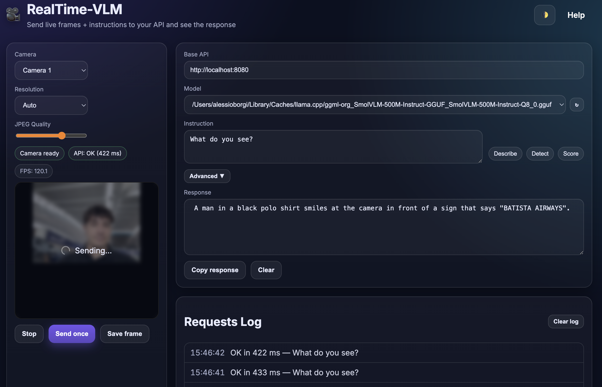
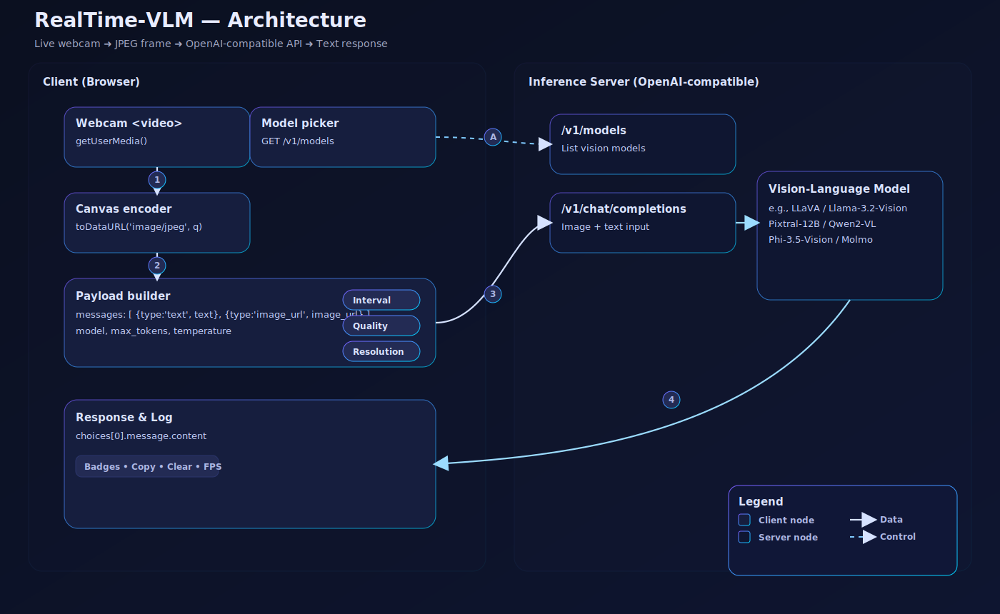

# RealTime‑VLM

**RealTime-VLM** brings real-time VLM inference to the browser. It continuously captures webcam frames, sends image+text to an OpenAI-compatible API, and displays responses with sub-second latency. Works with local or hosted VLMs; auto-discovers models from */v1/models* and uses */v1/chat/completions* for inference.

---

## ✨ Highlights

<p align="center">
  
</p>


- **Drop‑in UI**: modern glass style, dark mode, keyboard toggle (Space), request log, copy/clear, status badges, FPS.
- **Camera controls**: pick device, resolution (480p/720p/1080p/auto), and JPEG quality.
- **API controls**: base URL, **model selector** (auto‑fetch from `/v1/models`), custom model ID, interval, max tokens, temperature, overlay/autoscroll, “Test API” button.
- **One‑shot or live**: `Send once` or stream frames on an interval.
- **Zero build**: static files (`index.html`, `styles.css`, `app.js`) — host anywhere that serves HTTPS or use `localhost`.
- **Standards‑friendly**: uses `getUserMedia`, `canvas.toDataURL`, and OpenAI‑compatible **Chat Completions** with image content.

> Inspired by **smolvlm‑realtime‑webcam** (llama.cpp + SmolVLM demo), but extended with a richer UX, model picker, and advanced options.

---

## 🧩 Architecture
<p align="center">
  <picture>
    
  </picture>
</p>


---
## 🚀 Quick start (1‑minute, llama.cpp)

1) **Start a real‑time VLM server** (example: SmolVLM via `llama.cpp`):
```bash
# Fast local VLM (GPU optional with -ngl 99)
llama-server -hf ggml-org/SmolVLM-500M-Instruct-GGUF  # default port: 8080
```

2) **Open the UI**  
- Easiest: just open `index.html` in your browser.  
- If your browser blocks the camera on `file://`, serve the folder locally:
```bash
python3 -m http.server 8081    # then open http://localhost:8081
```

3) **Use the app**  
- Base API defaults to `http://localhost:8080` (change if needed).  
- Click **Test API**, pick a **Model** from `/v1/models` (or choose **Custom…**).  
- Hit **Start** (or **Send once**) and watch responses stream back in real time.

---

### Other backends (optional)

- **vLLM (OpenAI‑compatible)**
```bash
vllm serve mistralai/Pixtral-12B-2409 --host 0.0.0.0 --port 8000
# Base API: http://localhost:8000
```
- **Ollama (OpenAI‑compatible)**
```bash
# Example models vary by support: llama3.2-vision, pixtral, llava, qwen2-vl, etc.
ollama run llama3.2-vision
# Base API: http://localhost:11434/v1
```

## ✅ API contract (what the app expects)

- **List models**: `GET /v1/models` → returns `{ data: [{ id: "..." }, ...] }` (or `["id", ...]` is also accepted).
- **Chat completions**: `POST /v1/chat/completions` with **image_url** input, e.g.:
```jsonc
{
  "model": "your-vision-model-id",
  "max_tokens": 100,
  "temperature": 0.2,
  "messages": [
    { "role": "user", "content": [
      { "type": "text", "text": "What do you see?" },
      { "type": "image_url", "image_url": { "url": "data:image/jpeg;base64,..." } }
    ]}
  ]
}
```
- The app reads the text at `choices[0].message.content` in the response.

If your server uses a slightly different schema, adapt `app.js` in `sendChatCompletionRequest(...)`.

---

## 🧠 Supported models (examples)

RealTime‑VLM works with any **vision** model reachable behind an **OpenAI‑compatible** chat endpoint. Popular choices:

### Local / Open‑weights
- **SmolVLM‑500M Instruct (GGUF)** via llama.cpp — tiny & fast for demos.
- **LLaVA / LLaVA‑NeXT** (Llama‑3 / Qwen‑1.5 backbones) — strong general VLM baselines.
- **Llama 3.2‑Vision (11B / 90B)** — robust open vision models from Meta.
- **Phi‑3.5‑Vision‑Instruct** — lightweight multimodal model from Microsoft.
- **Pixtral‑12B** — Mistral’s multimodal 12B with strong doc understanding.
- **Qwen‑VL / Qwen2‑VL / Qwen2.5‑VL (3B/7B/32B/72B)** — high‑quality VLM family with video‑length support in newer versions.
- **Molmo (1B/7B/72B)** — Ai2’s open multimodal models, competitive at their sizes.

> Availability and exact IDs vary by distribution (HF, ModelScope, Ollama, vLLM, llama.cpp). Use the **Model** dropdown (fetches `/v1/models`) or enter a **Custom** ID.

### Hosted APIs (examples)
- **OpenRouter**, **vLLM**/**TGI** gateways, or vendor endpoints that expose **OpenAI‑style** `/v1` endpoints with image support.

---

## 🛠️ Configuration tips

- **Interval**: start at **500 ms**. If your model is fast (GPU/quantized), try **250 ms**.  
- **Resolution**: higher = clearer content, but more bandwidth & latency.  
- **JPEG quality**: 0.75–0.85 is a good trade‑off.  
- **Max tokens**: limit to reduce latency.  
- **Temperature**: keep **0.0–0.4** for crisp, factual outputs.  
- **Instruction**: steer the model (e.g., *“Return JSON with detected objects and bounding boxes.”*).

---

## 🔒 Privacy & security

- Camera frames are encoded **in the browser** and sent only to the API you configure.  
- Use **HTTPS** (or `localhost`) so `getUserMedia` works.  
- If self‑hosting the API, enable **CORS** for your origin and prefer **HTTP/2 + TLS**.  
- Avoid sending sensitive live video to untrusted endpoints.

---

## 🧪 Troubleshooting

- **Camera blocked**: Must be on **HTTPS** or `localhost`. Check browser permissions.  
- **CORS failures**: Configure your server to allow your origin and the `Content-Type` header.  
- **No models in dropdown**: Your server must implement `GET /v1/models`.  
- **No response**: Ensure your model **supports images** and the **Chat Completions** schema.  
- **Latency too high**: Lower resolution/quality, increase interval, or use GPU/quantized weights.

---

## 📦 Project structure

```
.
├─ index.html    # UI skeleton & layout
├─ styles.css    # Aesthetic (glass) styling + dark theme
├─ app.js        # Camera, API calls, model fetch, UX logic
└─ README.md
```

---

## 🗺️ Roadmap

- [ ] Streaming responses (SSE / `stream: true`)  
- [ ] Multi‑frame batching  
- [ ] Bounding‑box overlays for detector‑style prompts  
- [ ] JSON schema validation helpers  
- [ ] Minimal Node proxy with secure CORS presets

---

## 📚 References & model hubs (a few starting points)

- **smolvlm‑realtime‑webcam** (original demo) — llama.cpp + SmolVLM 500M  
  - https://github.com/ngxson/smolvlm-realtime-webcam
- **OpenAI model docs** (GPT‑4o & model catalog)  
  - https://platform.openai.com/docs/models
- **vLLM** — OpenAI‑compatible server mode  
  - https://docs.vllm.ai/en/latest/serving/openai_compatible_server.html
- **Ollama** — OpenAI‑compatible endpoint  
  - https://ollama.com/blog/openai-compatibility
- **LLaVA / LLaVA‑NeXT**  
  - https://github.com/haotian-liu/LLaVA
- **Llama 3.2 Vision** (Meta)  
  - https://ai.meta.com/blog/llama-3-2-connect-2024-vision-edge-mobile-devices/
- **Phi‑3.5‑Vision** (Microsoft)  
  - https://huggingface.co/microsoft/Phi-3.5-vision-instruct
- **Pixtral‑12B** (Mistral)  
  - https://mistral.ai/news/pixtral-12b
- **Qwen2‑VL / Qwen2.5‑VL**  
  - https://qwenlm.github.io/blog/qwen2-vl/  
  - https://qwenlm.github.io/blog/qwen2.5-vl/
- **Molmo** (Ai2)  
  - https://allenai.org/blog/molmo

---

## 📝 License

MIT — do whatever you want, just don’t remove attribution and be kind.

---

## ❤️ Acknowledgements

Thanks to the authors and communities behind **llama.cpp**, **vLLM**, **Ollama**, **LLaVA**, **Meta Llama**, **Microsoft Phi**, **Qwen**, **Mistral**, and **Ai2 Molmo** for pushing open and accessible multimodal research forward.
